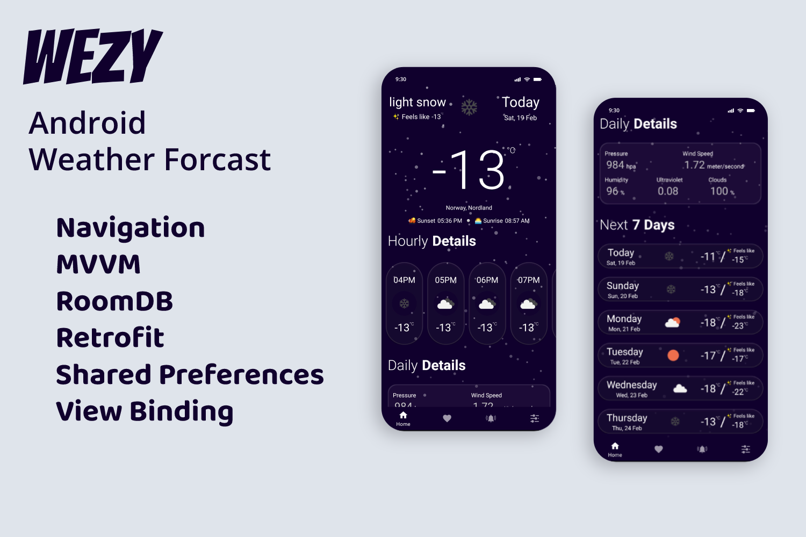
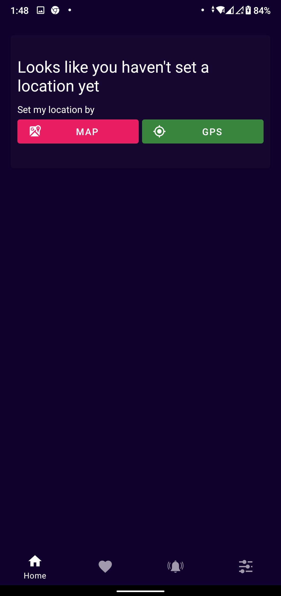
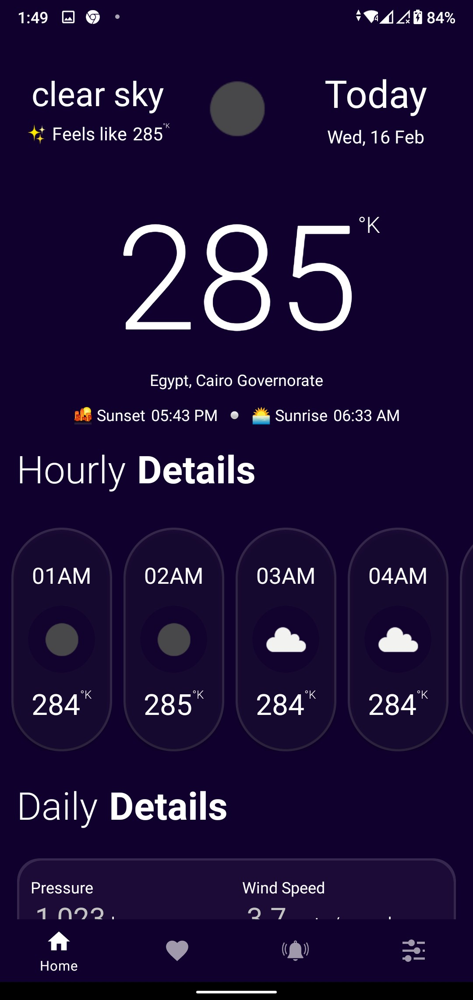
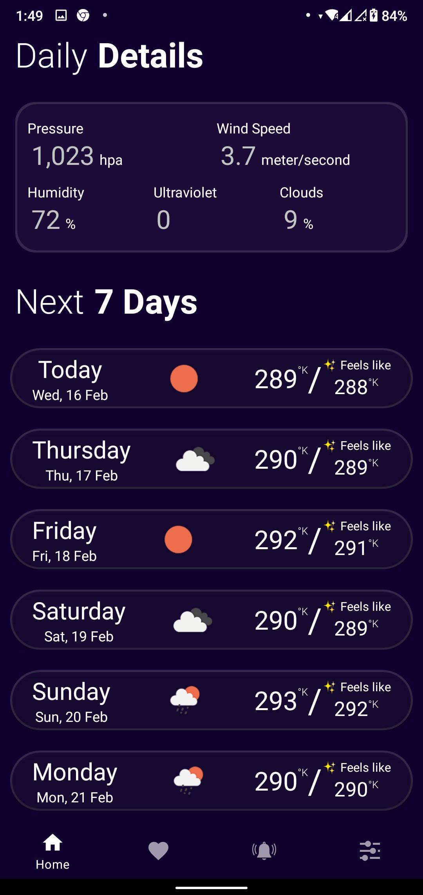
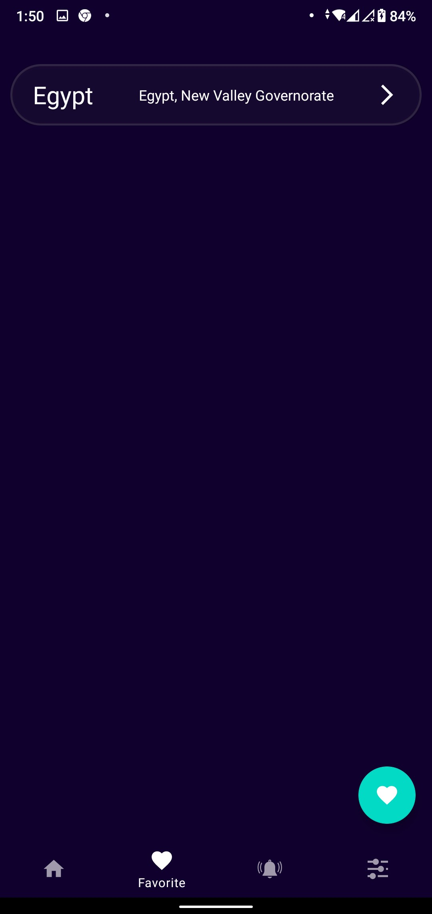
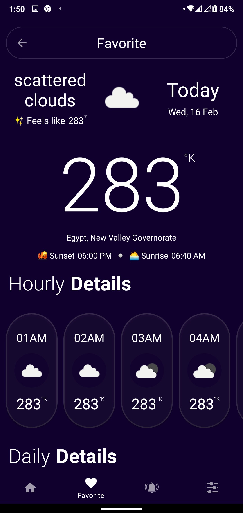
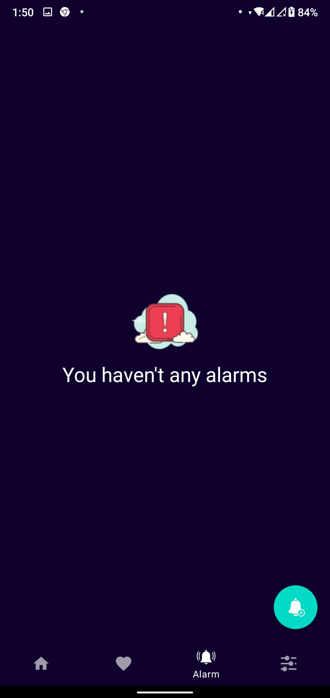
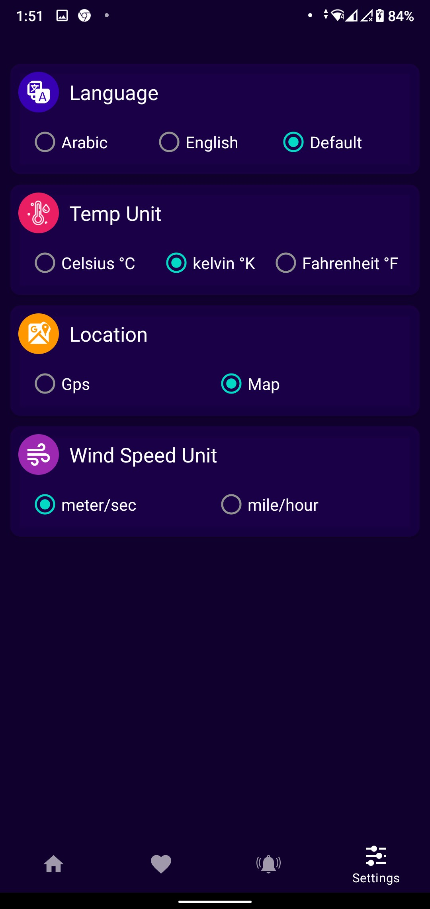
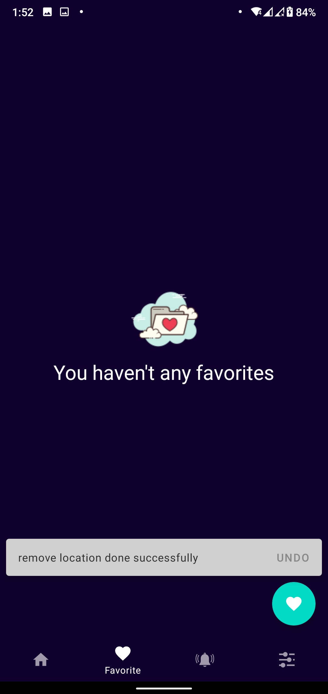

# WEZY Android weather app

WEZY is a simple weather forecast app, which uses some APIs to fetch 7 day forecast data from the OpenWeatherMap and to fetch places,cities,counties,coords etc. from Geocoder. The main goal of this app is to be a sample of how to build an high quality Android application that uses the Architecture components. in Kotlin.

## Requirements

Android studio last version  
JDK 8  
Android SDK 32  
Supports API Level +26

## Highlights

Use OpenWeatherMap API  
Support two language. English & Arabic  
Use locale Database

## Demo application is available in <a href="https://github.com/ahmedgomaa97/wezy/releases/tag/v1.0">Release</a>

## Screenshot

          

## Libraries and tools 🛠

Navigation  
Shared Preferences  
ViewModel  
LiveData  
View Binding  
RoomDB  
Retrofit  
OkHttp  
Glide  
Material Design
